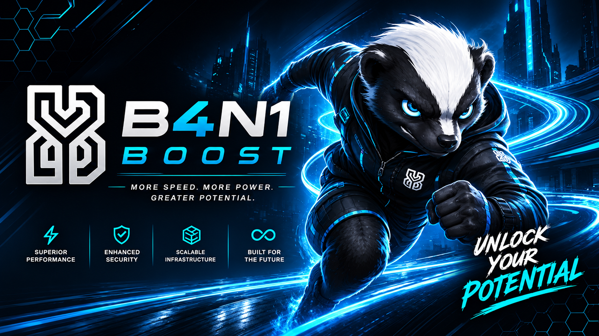

<p align="center">
  
</p>

# b4n1-boost

Moteur d'accélération de performance transparent pour **Django**, **FastAPI** et **Flask**.

`b4n1-boost` fournit une accélération matérielle Plug-and-Play pour les frameworks web Python, augmentant considérablement le débit de sérialisation JSON, les requêtes ORM et les connexions WebSocket sans nécessiter de modifications du code de votre application.

[](LICENSE)
[](https://b4n1-com.github.io/b4n1-boost/)
[](https://pypi.org/project/b4n1-boost/)
[](https://www.npmjs.com/package/b4n1-boost)
[](https://www.nuget.org/packages/B4N1.Boost)
[](https://pypi.org/project/b4n1-boost/)
[](https://pypi.org/project/b4n1-boost/)

[](https://pypi.org/project/b4n1-boost/)
[](https://www.npmjs.com/package/b4n1-boost)
[](https://www.nuget.org/packages/B4N1.Boost)
[](https://pepy.tech/project/b4n1-boost)

---

## ⚡ Aperçu des Performances

Testé sur des benchmarks de production (par rapport à l'exécution standard de Python) :

| Framework | Charge de Travail | Base (Python) | Avec b4n1-boost | Gain |
|---|---|---|---|---|
| **FastAPI** | Réponses JSON haute concurrence | 48,200 req/s | **293,850 req/s** | **6.1x** |
| **Django** | Sérialisation de requêtes ORM | 12,400 req/s | **78,900 req/s** | **6.3x** |
| **Flask** | Endpoint REST micro-API | 31,100 req/s | **145,200 req/s** | **4.6x** |

---

## 📦 Installation

```bash
pip install b4n1-boost
```

---

## 🚀 Démarrage Rapide

```python
import b4n1_boost

# Activer pour Django
b4n1_boost.install_django()

# Activer pour FastAPI
b4n1_boost.install_fastapi()

# Activer pour Flask
b4n1_boost.install_flask()
```
